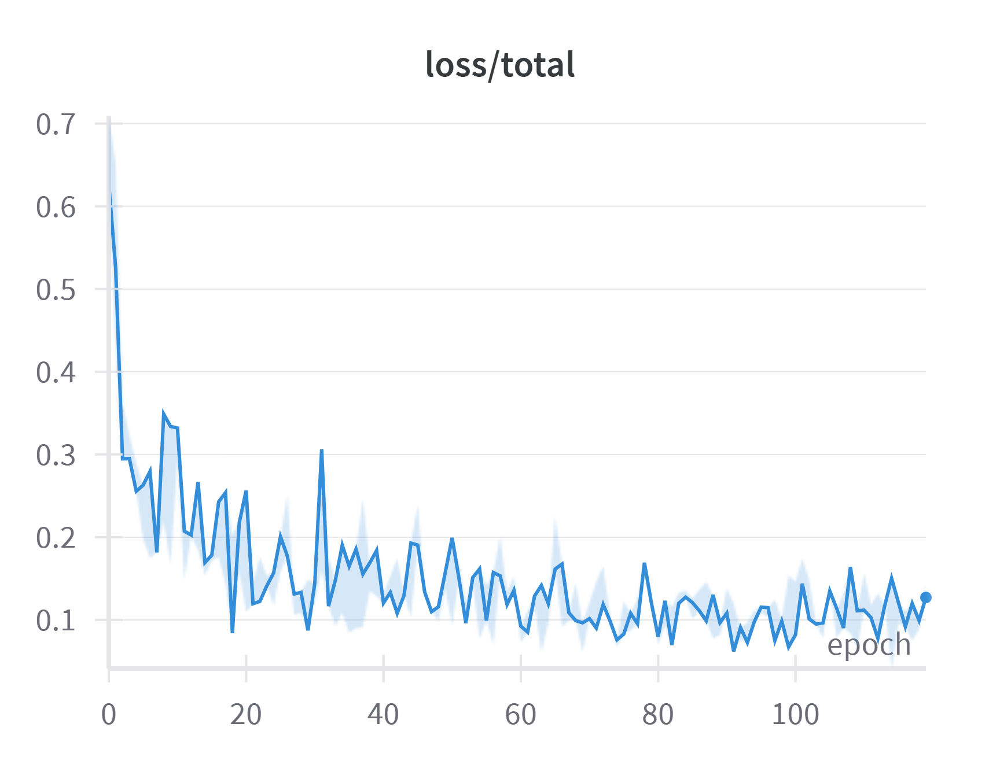
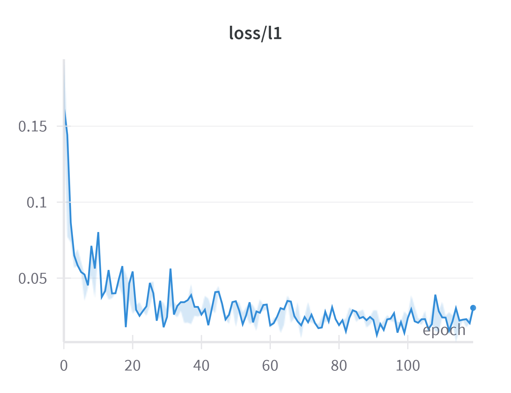
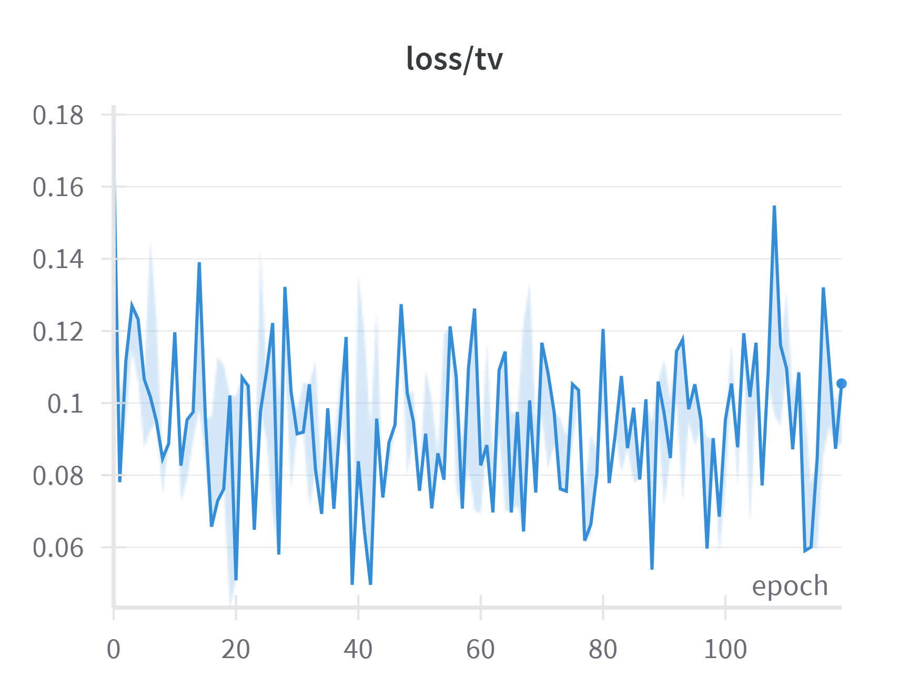
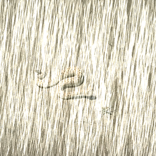

# Homework 4 - Image Restoration 🌧️❄️

Student ID: 313551073

Name: 顏琦恩

## Introduction

Homework 4 focuses on image restoration, where a model learns to recover high-quality images from degraded inputs without prior knowledge of the degradation type. This assignment targets two specific tasks: deraining and desnowing. The model is based on the PromptIR architecture, with several modifications made to better suit the task. The dataset is provided by the TAs, and training is conducted from scratch without using pretrained weights. Further details are provided below.

## How to Install

1. Clone this repository
```
git clone https://github.com/miayan0110/NYCU-Visual-Recognitionusing-Deep-Learning-2025-Spring.git
cd hw4
```

2. Create environment
The Conda environment used can be recreated using the env.yml file
```
conda env create -f env.yml
```

3. Dataset Preperation
The training data should be placed in ``` data/Train/Derain``` directory.
After placing the training data the directory structure would be as follows:
```
└───Train
    └───Derain
        ├───gt
        │   ├─rain_clean-1.png
        │   ├─rain_clean-2.png
        │   ├─snow_clean-1.png
        │   ├─snow_clean-2.png
        │   └─...
        └───rainy
            ├─rain-1.png
            ├─rain-2.png
            ├─snow-1.png
            ├─snow-2.png
            └─...
```
The ```data_dir``` file ```rainTrain.txt``` will also be needed, run
```
cd src
python datalist.py
```
to obtain the file, and place it into the folder ```data_dir/rainy```.

The testing data should be placed in ``` data/Test/degraded ``` directory.
After placing the training data the directory structure would be as follows:
```
└───Test
    ├───degraded
    │   ├─0.png
    │   ├─1.png
    │   ├─2.png
    │   └─...
    └───pred
```

## Getting started

### Training

After preparing the training data, use
```
python train.py --de_type derain
```
to start the training of the model.

### Testing

To obtain visual results from the model ```demo.py``` can be used. After placing the saved model file in ```ckpt``` directory, run:
```
python demo.py --test_path {path_to_degraded_images} --output_path {save_images_here}
```
Example usage to run inference on a directory of images:
```
python demo.py --test_path ./data/Test/degraded/ --output_path ./data/Test/pred/
```
Example usage to run inference on an image directly:
```
python demo.py --test_path './data/Test/degraded/0.png' --output_path './data/Test/degraded/'
```

To get the ```pred.npz``` file, use
```
cd ..
python example_img2npz.py
```

## Performance snapshot

### Below is the loss curve of the training process and score on the leaderboard:
|Total Loss|SSIM|L1|Total Variation Loss|
|:-:|:-:|:-:|:-:|
|  |  |  |  |


### Here are some visualizations of deraining and desnowing result:

<table cellpadding="8">
  <thead>
    <tr>
      <th></th>
      <th colspan="3" style="text-align:center;"><b>Desnow</b></th>
      <th colspan="3" style="text-align:center;"><b>Derain</b></th>
    </tr>
  </thead>
  <tbody>
    <tr>
      <td style="text-align:center;"><b>Degraded image</b></td>
      <td></td>
      <td></td>
      <td></td>
      <td></td>
      <td></td>
      <td></td>
    </tr>
    <tr>
      <td style="text-align:center;"><b>Output image</b></td>
      <td></td>
      <td></td>
      <td></td>
      <td></td>
      <td></td>
      <td></td>
    </tr>
  </tbody>
</table>
